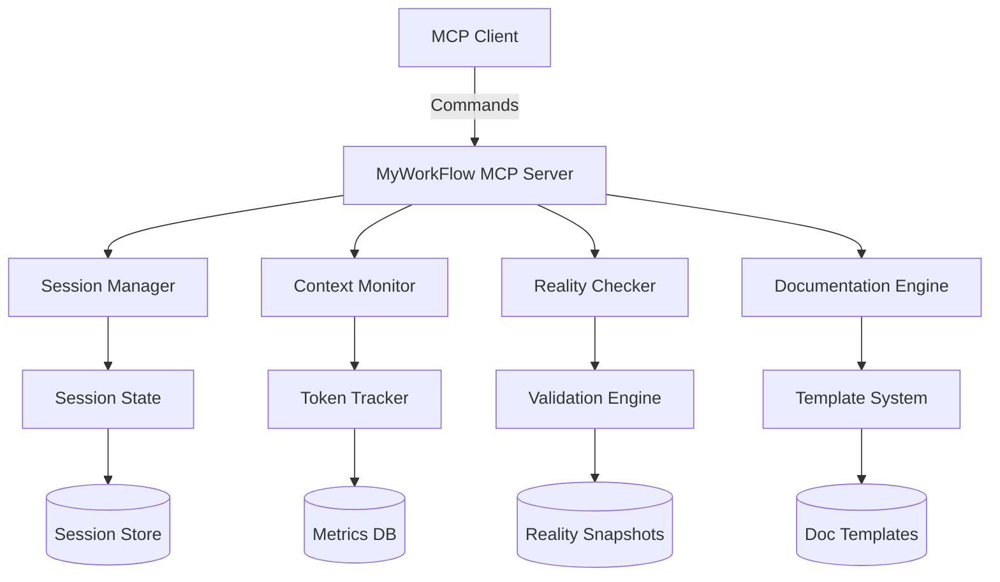
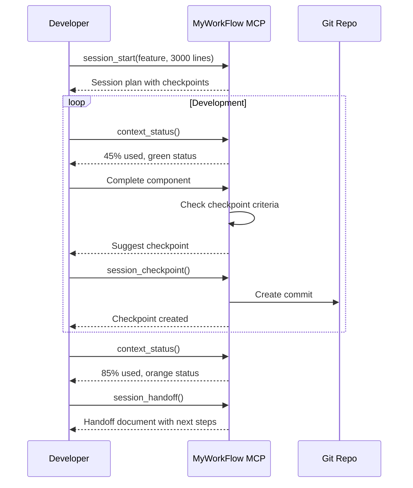
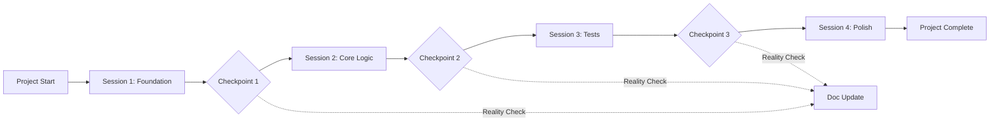

## Executive Summary

The MyWorkFlow MCP Server is a development assistant that programmatically implements context-aware session management, reality-based documentation, and efficient checkpoint strategies. It provides tools that enforce best practices for AI-assisted development, ensuring context efficiency and project coherence throughout the development lifecycle.

## 🎯 Core Objectives

### Primary Goals

1. **Context Efficiency**: Maximize productive output within token constraints
2. **Project Coherence**: Maintain consistent documentation that reflects reality
3. **Session Continuity**: Enable seamless handoffs between development sessions
4. **Development Velocity**: Accelerate development while maintaining quality

### Success Metrics

- 90%+ session completion without context exhaustion
- <10% documentation drift from reality
- 100% checkpoint recovery success rate
- 25% improvement in cross-session efficiency

## 🏗️ Architecture Overview



## 📋 Functional Requirements

### 1. Session Management Tools

#### `session_start`

Initializes a new development session with context planning.

```typescript
interface SessionStartParams {
  project_name: string;
  session_type: 'feature' | 'bugfix' | 'refactor' | 'documentation';
  estimated_scope: {
    lines_of_code: number;
    test_coverage: number;
    documentation: number;
  };
  context_budget?: number; // Override default allocation
}

interface SessionStartResponse {
  session_id: string;
  context_plan: ContextPlan;
  checkpoints: CheckpointPlan[];
  warnings: string[];
}
```

#### `session_checkpoint`

Creates a checkpoint at natural boundaries.

```typescript
interface CheckpointParams {
  session_id: string;
  completed_components: string[];
  metrics: {
    lines_written: number;
    tests_passing: number;
    context_used_percent: number;
  };
  commit_message?: string;
  force?: boolean; // Override safety checks
}

interface CheckpointResponse {
  checkpoint_id: string;
  commit_hash?: string;
  context_snapshot: ContextSnapshot;
  continuation_plan: ContinuationPlan;
}
```

### 2. Context Monitoring Tools

#### `context_status`

Real-time context usage monitoring.

```typescript
interface ContextStatusParams {
  session_id: string;
  include_predictions?: boolean;
}

interface ContextStatusResponse {
  used_tokens: number;
  total_tokens: number;
  percentage_used: number;
  status: 'green' | 'yellow' | 'orange' | 'red';
  predicted_completion: number; // Estimated tokens to complete
  recommendations: string[];
}
```

#### `context_optimize`

Suggests optimizations to preserve context.

```typescript
interface OptimizeParams {
  session_id: string;
  target_savings: number; // Percentage to save
}

interface OptimizeResponse {
  suggestions: OptimizationSuggestion[];
  potential_savings: number;
  impact_assessment: string;
}
```

### 3. Reality Verification Tools

#### `reality_check`

Validates documentation against actual implementation.

```typescript
interface RealityCheckParams {
  project_path: string;
  check_types: ('features' | 'tests' | 'performance' | 'dependencies')[];
  fix_documentation?: boolean;
}

interface RealityCheckResponse {
  accuracy_score: number;
  discrepancies: Discrepancy[];
  fixed_items?: string[];
  recommendations: string[];
}
```

#### `metric_validate`

Ensures metrics include proper context.

```typescript
interface MetricValidateParams {
  metric_claims: MetricClaim[];
  require_context?: boolean;
}

interface MetricValidateResponse {
  validated_metrics: ValidatedMetric[];
  missing_context: string[];
  suggestions: string[];
}
```

### 4. Documentation Management Tools

#### `doc_generate`

Creates reality-based documentation from templates.

```typescript
interface DocGenerateParams {
  template_type: 'session_summary' | 'checkpoint' | 'reality_check' | 'project_start';
  session_id?: string;
  custom_data?: Record<string, any>;
}

interface DocGenerateResponse {
  document_content: string;
  document_path: string;
  validation_status: ValidationStatus;
}
```

#### `doc_update`

Updates documentation while maintaining integrity.

```typescript
interface DocUpdateParams {
  document_path: string;
  updates: DocumentUpdate[];
  validate_reality?: boolean;
}

interface DocUpdateResponse {
  updated_content: string;
  change_summary: string[];
  reality_score?: number;
}
```

### 5. Progress Tracking Tools

#### `progress_report`

Generates comprehensive progress analysis.

```typescript
interface ProgressReportParams {
  session_id?: string; // Current session or all
  time_range?: TimeRange;
  include_predictions?: boolean;
}

interface ProgressReportResponse {
  sessions_analyzed: number;
  total_progress: ProgressMetrics;
  velocity_trends: VelocityData;
  estimation_accuracy: AccuracyMetrics;
  recommendations: string[];
}
```

### 6. Intelligent Handoff Tools

#### `session_handoff`

Prepares comprehensive handoff documentation.

```typescript
interface HandoffParams {
  session_id: string;
  next_session_goals?: string[];
  include_context_dump?: boolean;
}

interface HandoffResponse {
  handoff_document: string;
  context_requirements: ContextRequirement[];
  prerequisite_checks: PrerequisiteCheck[];
  estimated_next_session: SessionEstimate;
}
```

## 🔧 Non-Functional Requirements

### Performance Requirements

- Context analysis: <100ms response time
- Checkpoint creation: <5 seconds including commit
- Reality check: <30 seconds for average project
- Documentation generation: <2 seconds

### Reliability Requirements

- 99.9% uptime for session management
- Zero data loss for checkpoints
- Automatic recovery from crashes
- Graceful degradation on resource limits

### Security Requirements

- No storage of sensitive code content
- Encrypted session state
- Audit trail for all operations
- Configurable retention policies

## 🎨 Implementation Patterns

### Context-Aware Responses

The MCP server should automatically adjust its behavior based on context usage:

```typescript
class ContextAwareResponse {
  adjustForContext(response: any, contextStatus: ContextStatus): any {
    if (contextStatus.percentage_used > 70) {
      return this.toCompactFormat(response);
    } else if (contextStatus.percentage_used > 85) {
      return this.toMinimalFormat(response);
    }
    return response;
  }
}
```

### Reality Enforcement

All documentation operations should enforce reality principles:

```typescript
class RealityEnforcer {
  validateClaim(claim: Claim): ValidatedClaim {
    // Check for context
    if (!claim.context && claim.type === 'metric') {
      throw new Error('Metrics require context');
    }
    
    // Verify against actual state
    const actual = this.measureActual(claim);
    if (!claim.matchesReality(actual)) {
      return this.adjustToReality(claim, actual);
    }
    
    return claim;
  }
}
```

### Progressive Checkpoint Strategy

Checkpoints should be created based on multiple factors:

```typescript
class CheckpointStrategy {
  shouldCheckpoint(session: Session): boolean {
    const factors = {
      contextUsage: session.contextUsedPercent > 60,
      naturalBoundary: session.hasCompletedComponent(),
      timeBased: session.durationMinutes > 120,
      riskBased: session.hasUnsavedCriticalWork()
    };
    
    return Object.values(factors).filter(Boolean).length >= 2;
  }
}
```

## 🔄 Workflow Integration

### Typical Development Flow



### Multi-Session Project Flow



## 📊 Metrics and Analytics

### Session Metrics

- Average context efficiency (target: >80%)
- Checkpoint success rate (target: >95%)
- Documentation accuracy (target: >90%)
- Session completion rate (target: >95%)

### Project Metrics

- Cross-session continuity score
- Estimation accuracy over time
- Reality drift rate
- Developer velocity trends

## 🚀 Advanced Features

### 1. Predictive Context Management

```typescript
interface PredictiveContext {
  analyzePattern(session: Session): ContextPrediction;
  suggestOptimalCheckpoints(): CheckpointPlan[];
  warnOfContextExhaustion(): WarningData;
}
```

### 2. Automated Reality Sync

```typescript
interface RealitySync {
  scheduleChecks(): CronSchedule;
  autoFixDocumentation(): FixReport;
  trackDriftTrends(): DriftAnalysis;
}
```

### 3. Intelligent Session Planning

```typescript
interface SessionPlanner {
  analyzeScope(requirements: Requirements): SessionPlan[];
  optimizeForContext(plan: SessionPlan): OptimizedPlan;
  suggestBreakpoints(): Breakpoint[];
}
```

## 🤖 Sub-Agent System Requirements

### Overview
The Sub-Agent system enhances MyWorkFlow with specialized AI agents that work alongside Claude Code to provide domain-specific intelligence and automation.

### Core Sub-Agents

#### 1. Symbol Contractor Agent
**Purpose**: Manage consistent naming across the codebase
**Key Features**:
- Symbol registry with project-specific patterns
- Confidence scoring for naming suggestions
- Evolution tracking for refactoring impact
- Integration with existing code analysis

#### 2. Session Orchestrator Agent  
**Purpose**: Proactive session and context management
**Key Features**:
- Automatic checkpoint recommendations
- Context usage forecasting
- Emergency intervention at critical thresholds
- Session planning optimization

#### 3. Context Guardian Agent
**Purpose**: Optimize and preserve context budget
**Key Features**:
- Pre-analysis of files before loading
- Token usage prediction
- Context compression suggestions
- Pattern-based optimization

#### 4. Documentation Curator Agent
**Purpose**: Maintain accurate, reality-based documentation
**Key Features**:
- Integration with Reality Checker
- Automatic documentation updates
- Drift detection and correction
- Template-based generation

#### 5. Workflow Consistency Agent
**Purpose**: Enforce patterns and best practices
**Key Features**:
- Code pattern analysis
- Anti-pattern detection
- Refactoring suggestions
- Style enforcement

### Technical Requirements

#### Database Enhancements
- Agent memory for learning from past decisions
- Symbol registry for naming consistency
- Activity tracking for performance monitoring
- Task queue for asynchronous operations

#### Context Management
- Maximum 50% of total context for agent pool
- Individual agent budgets with weights
- Dynamic reallocation based on usage
- Priority-based execution

#### User Interface
- Context allocation sliders
- Agent activity visualization
- Symbol registry browser
- Performance metrics dashboard

### Agent Integration Points

#### MCP Tool Extensions
```typescript
// Symbol registry tools
interface SymbolTools {
  symbol_query(concept: string, context: string): SymbolSuggestion;
  symbol_register(concept: string, name: string): RegistrationResult;
  symbol_search(query: string): Symbol[];
}

// Agent memory tools
interface AgentMemoryTools {
  agent_memory_query(agent: string, action: string): Decision[];
  agent_memory_record(decision: AgentDecision): void;
  agent_activity_log(activity: AgentActivity): void;
}
```

#### WebSocket Events
```typescript
// Agent-specific events
interface AgentEvents {
  'agent.suggestion': {
    agent_name: string;
    suggestion: any;
    confidence: number;
  };
  'agent.decision': {
    agent_name: string;
    decision: string;
    context: any;
  };
  'agent.conflict': {
    agents: string[];
    conflict_type: string;
    resolution_needed: boolean;
  };
}
```

### Success Metrics
- 50% reduction in naming inconsistencies
- 90% reduction in context exhaustion incidents
- <200ms agent response time (95th percentile)
- >4.5/5 user satisfaction rating
- 30% improvement in code quality metrics

## 🔒 Configuration

### Server Configuration

```yaml
myworkflow_mcp:
  session:
    default_context_limit: 100000
    warning_threshold: 0.7
    critical_threshold: 0.85
    checkpoint_interval: 3600
    
  reality_check:
    auto_check_enabled: true
    check_frequency: "daily"
    fix_documentation: false
    
  documentation:
    template_path: "./templates"
    auto_generate_summaries: true
    enforce_reality_principles: true
    
  monitoring:
    track_metrics: true
    retention_days: 90
    export_format: "json"
```

## 🎯 Success Criteria

The MyWorkFlow MCP Server will be considered successful when:

1. **Efficiency**: 90% of sessions complete without context exhaustion
2. **Accuracy**: Documentation drift remains below 10%
3. **Continuity**: 100% of checkpoints enable successful session continuation
4. **Adoption**: Developers report 25% productivity improvement
5. **Reliability**: Zero data loss incidents over 6 months

## 📝 Appendix: Core Principles Implementation

### Reality-Based Documentation

Every documentation operation must:

- Include context for metrics
- Distinguish plans from implementation
- Preserve evidence of attempts
- Update based on actual state

### Context-Aware Development

Every response must:

- Monitor token usage
- Adjust verbosity based on context
- Suggest checkpoints proactively
- Preserve buffer for emergencies

### Session Continuity

Every session must:

- Create recoverable checkpoints
- Document handoff requirements
- Track progress accurately
- Enable seamless continuation