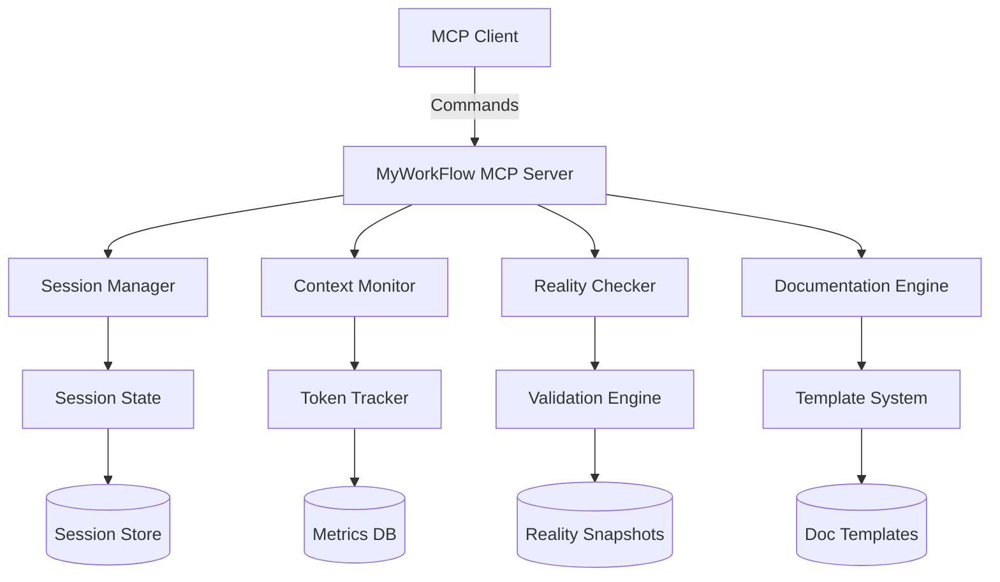
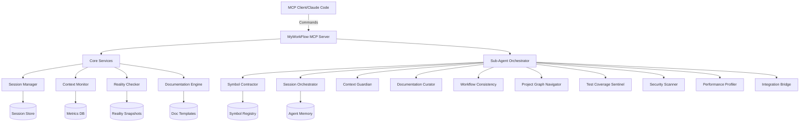

# 🤖 AI Assistant Quick Reference - MyWorkFlow MCP Server

This document serves as a quick reference guide for developers working with the MyWorkFlow MCP Server, providing an overview of the architecture, interface definitions, tool endpoints, configuration schemas, and best practices for using AI assistants effectively.

## 🏗️ Architecture Overview



## 🤖 Sub-Agents Architecture

### Enhanced Architecture with Sub-Agents



### Sub-Agent Interfaces

```typescript
// Agent Base Interface
interface SubAgent {
  name: string;
  description: string;
  tools: string[];
  priority: 'critical' | 'high' | 'medium' | 'low';
  contextBudget: number; // Percentage of agent pool
}

// Agent Memory Interface
interface AgentMemory {
  agent_name: string;
  action_type: string;
  input_context: string;
  decision_made: string;
  worked: boolean;
  project_id: string;
  session_id?: string;
}

// Symbol Registry Interface
interface Symbol {
  id: string;
  concept: string;
  chosen_name: string;
  context_type: 'class' | 'function' | 'variable' | 'constant' | 'interface';
  project_id: string;
  confidence_score: number;
  usage_count: number;
}

// Context Allocation Interface
interface ContextAllocation {
  agentPoolPercentage: number; // 0-50% of total context
  agentWeights: {
    symbolContractor: number;
    sessionOrchestrator: number;
    contextGuardian: number;
    documentationCurator: number;
    others: number;
  };
  autoBalance: boolean;
  priorityMode: 'balanced' | 'quality' | 'speed';
}
```

## 🛠️ Interface Definitions

### Session Management Interfaces

```typescript
// Session lifecycle management
interface SessionStartParams {
  project_name: string;
  session_type: 'feature' | 'bugfix' | 'refactor' | 'documentation';
  estimated_scope: {
    lines_of_code: number;
    test_coverage: number;
    documentation: number;
  };
  context_budget?: number;
}

interface Session {
  id: string;
  project_name: string;
  session_type: 'feature' | 'bugfix' | 'refactor' | 'documentation';
  start_time: number;
  estimated_completion: number;
  current_phase: string;
  status: 'active' | 'checkpoint' | 'handoff' | 'complete';
  estimated_scope: EstimatedScope;
  context_plan: ContextPlan;
  checkpoints: CheckpointPlan[];
  metrics: SessionMetrics;
  ui_state?: {
    expanded: boolean;
    refresh_interval: number;
    layout: 'card' | 'inline' | 'minimal';
  };
}

interface CheckpointParams {
  session_id: string;
  completed_components: string[];
  metrics: {
    lines_written: number;
    tests_passing: number;
    context_used_percent: number;
  };
  commit_message?: string;
  force?: boolean;
}

interface CheckpointResponse {
  checkpoint_id: string;
  commit_hash?: string;
  context_snapshot: ContextSnapshot;
  continuation_plan: ContinuationPlan;
}

interface HandoffParams {
  session_id: string;
  next_session_goals?: string[];
  include_context_dump?: boolean;
}

interface HandoffResponse {
  handoff_document: string;
  context_requirements: ContextRequirement[];
  prerequisite_checks: PrerequisiteCheck[];
  estimated_next_session: SessionEstimate;
}
```

### Context Monitoring Interfaces

```typescript
interface ContextStatus {
  session_id: string;
  used_tokens: number;
  total_tokens: number;
  percentage_used: number;
  status: 'green' | 'yellow' | 'orange' | 'red';
  trend: 'stable' | 'increasing' | 'rapid';
  predicted_completion: number;
  recommendations: string[];
  // UI-specific fields
  max_tokens: number;
  warning_threshold: number;
  critical_threshold: number;
  display_mode: 'detailed' | 'compact' | 'minimal';
  chart_data?: {
    history: Array<{ time: number; tokens: number }>;
    prediction_line: Array<{ time: number; tokens: number }>;
  };
  optimization_available?: boolean;
  tokens_per_minute?: number;
}

interface ContextPrediction {
  timestamp: number;
  predicted_tokens: number;
  confidence: number;
  based_on: 'linear' | 'exponential' | 'pattern';
}

interface OptimizeParams {
  session_id: string;
  target_savings: number;
}

interface OptimizeResponse {
  suggestions: OptimizationSuggestion[];
  potential_savings: number;
  impact_assessment: string;
}
```

### Reality Check Interfaces

```typescript
interface RealityCheckParams {
  project_path: string;
  check_types: ('features' | 'tests' | 'performance' | 'dependencies')[];
  fix_documentation?: boolean;
}

interface RealityCheckResponse {
  accuracy_score: number;
  discrepancies: Discrepancy[];
  fixed_items?: string[];
  recommendations: string[];
}

interface Discrepancy {
  id: string;
  title: string;
  claimed: string;
  actual: string;
  component: string;
  severity: 'low' | 'medium' | 'high';
  fix_available: boolean;
  actions: ('view' | 'fix' | 'ignore' | 'schedule')[];
}

interface DiscrepancyGroup {
  severity: 'low' | 'medium' | 'high';
  type: 'feature' | 'test' | 'performance' | 'documentation';
  items: Discrepancy[];
  group_by: 'severity' | 'type' | 'component';
}

interface MetricValidateParams {
  metric_claims: MetricClaim[];
  require_context?: boolean;
}

interface ValidatedMetric {
  claim: string;
  actual: string;
  valid: boolean;
  context_provided: boolean;
  evidence?: string;
}
```

### Documentation Interfaces

```typescript
interface DocGenerateParams {
  template_type: 'session_summary' | 'checkpoint' | 'reality_check' | 'project_start';
  session_id?: string;
  custom_data?: Record<string, any>;
}

interface DocGenerateResponse {
  document_content: string;
  document_path: string;
  validation_status: ValidationStatus;
}

interface DocUpdateParams {
  document_path: string;
  updates: DocumentUpdate[];
  validate_reality?: boolean;
}

interface DocumentStatus {
  path: string;
  type: DocumentType;
  last_updated: number;
  accuracy_score: number;
  status: 'current' | 'outdated' | 'missing';
  issues: string[];
}

type DocumentType = 'readme' | 'api' | 'architecture' | 'testing' | 'deployment';
```

### Project Tracking Interfaces

```typescript
interface Project {
  id: string;
  name: string;
  sessions: SessionSummary[];
  current_session?: string;
  total_progress: number;
  velocity: VelocityMetrics;
  blockers: Blocker[];
  upcoming_sessions: PlannedSession[];
  display_mode: 'timeline' | 'kanban' | 'list';
}

interface VelocityMetrics {
  lines_per_session: number;
  sessions_per_week: number;
  trend: 'increasing' | 'stable' | 'decreasing';
  average_completion_rate: number;
}

interface Blocker {
  id: string;
  type: 'technical' | 'dependency' | 'resource' | 'decision';
  description: string;
  impact: 'high' | 'medium' | 'low';
  sessions_affected: string[];
}

interface ProgressReportParams {
  session_id?: string;
  time_range?: TimeRange;
  include_predictions?: boolean;
}
```

### Quick Actions Interfaces

```typescript
interface QuickAction {
  id: string;
  label: string;
  category: 'immediate' | 'planning' | 'documentation' | 'emergency';
  enabled: boolean;
  priority?: 'high' | 'medium' | 'low' | 'critical';
  keyboard_shortcut?: string;
}

interface ActionSuggestion {
  action: QuickAction;
  reason: string;
  confidence: number;
  context_based: boolean;
}

interface CustomAction {
  name: string;
  command: string;
  parameters?: Record<string, any>;
  icon?: string;
  when?: string; // Condition expression
}
```

## 🛠️ MCP Tool Endpoints

### Session Management Tools

```typescript
// session_start
{
  name: "session_start",
  description: "Start a new development session with context planning",
  inputSchema: {
    type: "object",
    properties: {
      project_name: { type: "string" },
      session_type: { 
        type: "string",
        enum: ["feature", "bugfix", "refactor", "documentation"]
      },
      estimated_scope: {
        type: "object",
        properties: {
          lines_of_code: { type: "number" },
          test_coverage: { type: "number" },
          documentation: { type: "number" }
        },
        required: ["lines_of_code"]
      },
      context_budget: { type: "number" }
    },
    required: ["project_name", "session_type", "estimated_scope"]
  }
}

// session_checkpoint
{
  name: "session_checkpoint",
  description: "Create a checkpoint at natural boundaries",
  inputSchema: {
    type: "object",
    properties: {
      session_id: { type: "string" },
      completed_components: { 
        type: "array",
        items: { type: "string" }
      },
      metrics: {
        type: "object",
        properties: {
          lines_written: { type: "number" },
          tests_passing: { type: "number" },
          context_used_percent: { type: "number" }
        }
      },
      commit_message: { type: "string" },
      force: { type: "boolean" }
    },
    required: ["session_id", "completed_components", "metrics"]
  }
}

// session_handoff
{
  name: "session_handoff",
  description: "Prepare comprehensive handoff documentation",
  inputSchema: {
    type: "object",
    properties: {
      session_id: { type: "string" },
      next_session_goals: {
        type: "array",
        items: { type: "string" }
      },
      include_context_dump: { type: "boolean" }
    },
    required: ["session_id"]
  }
}
```

### Context Monitoring Tools

```typescript
// context_status
{
  name: "context_status",
  description: "Get current context usage with visualization data",
  inputSchema: {
    type: "object",
    properties: {
      session_id: { type: "string" },
      include_predictions: { type: "boolean" }
    },
    required: ["session_id"]
  }
}

// context_optimize
{
  name: "context_optimize",
  description: "Get optimization suggestions to preserve context",
  inputSchema: {
    type: "object",
    properties: {
      session_id: { type: "string" },
      target_savings: { type: "number" }
    },
    required: ["session_id", "target_savings"]
  }
}

// context_history
{
  name: "context_history",
  description: "Get token usage history for charts",
  inputSchema: {
    type: "object",
    properties: {
      session_id: { type: "string" },
      time_range: { type: "string" }
    },
    required: ["session_id"]
  }
}
```

### Reality Check Tools

```typescript
// reality_check
{
  name: "reality_check",
  description: "Validate documentation against actual implementation",
  inputSchema: {
    type: "object",
    properties: {
      project_path: { type: "string" },
      check_types: {
        type: "array",
        items: {
          type: "string",
          enum: ["features", "tests", "performance", "dependencies"]
        }
      },
      fix_documentation: { type: "boolean" }
    },
    required: ["project_path", "check_types"]
  }
}

// metric_validate
{
  name: "metric_validate",
  description: "Ensure metrics include proper context",
  inputSchema: {
    type: "object",
    properties: {
      metric_claims: {
        type: "array",
        items: {
          type: "object",
          properties: {
            claim: { type: "string" },
            value: { type: "string" },
            context: { type: "string" }
          }
        }
      },
      require_context: { type: "boolean" }
    },
    required: ["metric_claims"]
  }
}

// fix_discrepancy
{
  name: "fix_discrepancy",
  description: "Fix a documentation discrepancy",
  inputSchema: {
    type: "object",
    properties: {
      discrepancy_id: { type: "string" }
    },
    required: ["discrepancy_id"]
  }
}
```

### Documentation Tools

```typescript
// doc_generate
{
  name: "doc_generate",
  description: "Create reality-based documentation from templates",
  inputSchema: {
    type: "object",
    properties: {
      template_type: {
        type: "string",
        enum: ["session_summary", "checkpoint", "reality_check", "project_start"]
      },
      session_id: { type: "string" },
      custom_data: { type: "object" }
    },
    required: ["template_type"]
  }
}

// doc_update
{
  name: "doc_update",
  description: "Update documentation while maintaining integrity",
  inputSchema: {
    type: "object",
    properties: {
      document_path: { type: "string" },
      updates: {
        type: "array",
        items: {
          type: "object",
          properties: {
            section: { type: "string" },
            content: { type: "string" },
            validate: { type: "boolean" }
          }
        }
      },
      validate_reality: { type: "boolean" }
    },
    required: ["document_path", "updates"]
  }
}

// scan_documents
{
  name: "scan_documents",
  description: "Scan project documentation health",
  inputSchema: {
    type: "object",
    properties: {
      project_path: { type: "string" }
    },
    required: ["project_path"]
  }
}
```

### Project Tracking Tools

```typescript
// progress_report
{
  name: "progress_report",
  description: "Generate comprehensive progress analysis",
  inputSchema: {
    type: "object",
    properties: {
      session_id: { type: "string" },
      time_range: {
        type: "object",
        properties: {
          start: { type: "string" },
          end: { type: "string" }
        }
      },
      include_predictions: { type: "boolean" }
    }
  }
}

// project_status
{
  name: "project_status",
  description: "Get multi-session project status",
  inputSchema: {
    type: "object",
    properties: {
      project_id: { type: "string" }
    },
    required: ["project_id"]
  }
}

// switch_view
{
  name: "switch_view",
  description: "Switch project tracker view mode",
  inputSchema: {
    type: "object",
    properties: {
      mode: {
        type: "string",
        enum: ["timeline", "kanban", "list"]
      }
    },
    required: ["mode"]
  }
}
```

### Quick Action Tools

```typescript
// execute_action
{
  name: "execute_action",
  description: "Execute a quick action",
  inputSchema: {
    type: "object",
    properties: {
      action_id: { type: "string" }
    },
    required: ["action_id"]
  }
}

// get_suggested_actions
{
  name: "get_suggested_actions",
  description: "Get context-aware action suggestions",
  inputSchema: {
    type: "object",
    properties: {
      session_id: { type: "string" },
      context_state: { type: "object" }
    }
  }
}

// add_custom_action
{
  name: "add_custom_action",
  description: "Add a custom quick action",
  inputSchema: {
    type: "object",
    properties: {
      name: { type: "string" },
      command: { type: "string" },
      parameters: { type: "object" },
      icon: { type: "string" },
      when: { type: "string" }
    },
    required: ["name", "command"]
  }
}
```

### UI Integration Tools

```typescript
// session_refresh
{
  name: "session_refresh",
  description: "Refresh session display with UI data",
  inputSchema: {
    type: "object",
    properties: {
      session_id: { type: "string" }
    },
    required: ["session_id"]
  }
}

// subscribe_updates
{
  name: "subscribe_updates",
  description: "Subscribe to real-time updates",
  inputSchema: {
    type: "object",
    properties: {
      event_types: {
        type: "array",
        items: {
          type: "string",
          enum: ["session", "context", "reality", "documentation"]
        }
      }
    },
    required: ["event_types"]
  }
}
```

### Sub-Agent Tool Endpoints

```typescript
// symbol_query
{
  name: "symbol_query",
  description: "Query naming convention for a concept",
  inputSchema: {
    type: "object",
    properties: {
      concept: { type: "string" },
      context_type: { type: "string" },
      project_id: { type: "string" }
    },
    required: ["concept", "context_type", "project_id"]
  }
}

// symbol_register
{
  name: "symbol_register",
  description: "Register a naming decision",
  inputSchema: {
    type: "object",
    properties: {
      concept: { type: "string" },
      chosen_name: { type: "string" },
      context_type: { type: "string" },
      project_id: { type: "string" },
      confidence_score: { type: "number" }
    },
    required: ["concept", "chosen_name", "context_type", "project_id"]
  }
}

// agent_memory_query
{
  name: "agent_memory_query",
  description: "Query agent past decisions",
  inputSchema: {
    type: "object",
    properties: {
      agent_name: { type: "string" },
      action_type: { type: "string" },
      project_id: { type: "string" }
    },
    required: ["agent_name", "action_type"]
  }
}

// agent_task_enqueue
{
  name: "agent_task_enqueue",
  description: "Add task to agent queue",
  inputSchema: {
    type: "object",
    properties: {
      agent_name: { type: "string" },
      priority: { type: "number" },
      task_data: { type: "object" }
    },
    required: ["agent_name", "task_data"]
  }
}

// agent_activity_log
{
  name: "agent_activity_log",
  description: "Log agent activity",
  inputSchema: {
    type: "object",
    properties: {
      agent_name: { type: "string" },
      session_id: { type: "string" },
      duration_ms: { type: "number" },
      tokens_used: { type: "number" },
      error: { type: "string" }
    },
    required: ["agent_name", "duration_ms"]
  }
}
```

## ⚙️ Configuration Schemas

### Server Configuration (myworkflow.config.yml)

```yaml
myworkflow_mcp:
  # Core Settings
  server:
    name: "myworkflow-mcp"
    version: "1.0.0"
    port: 3000
    host: "localhost"
    
  # Session Management
  session:
    default_context_limit: 100000
    warning_threshold: 0.7
    critical_threshold: 0.85
    emergency_threshold: 0.95
    checkpoint_interval: 3600
    auto_checkpoint: true
    
  # Context Monitoring
  context:
    tracking_enabled: true
    prediction_model: "adaptive"
    optimization_level: "balanced"
    history_retention: 30 # days
    
  # Reality Checking
  reality_check:
    auto_check_enabled: true
    check_frequency: "daily"
    fix_documentation: false
    validation_strictness: "moderate"
    
  # Documentation
  documentation:
    template_path: "./templates"
    auto_generate_summaries: true
    enforce_reality_principles: true
    format: "markdown"
    
  # Database Configuration
  database:
    type: "sqlite" # or "postgresql"
    path: ".myworkflow/data.db"
    # For PostgreSQL:
    # host: "localhost"
    # port: 5432
    # database: "myworkflow"
    # user: "myworkflow_user"
    # password: "${MYWORKFLOW_DB_PASSWORD}"
    
  # Monitoring & Metrics
  monitoring:
    track_metrics: true
    retention_days: 90
    export_format: "json"
    prometheus_enabled: false
    
  # UI Integration
  ui:
    enable_websocket: true
    realtime_updates: true
    update_interval: 1000 # ms
    theme: "auto"
```

### Database Schema

```sql
-- Sessions table
CREATE TABLE sessions (
  id TEXT PRIMARY KEY,
  project_name TEXT NOT NULL,
  session_type TEXT NOT NULL,
  start_time INTEGER NOT NULL,
  end_time INTEGER,
  estimated_lines INTEGER NOT NULL,
  actual_lines INTEGER DEFAULT 0,
  context_used_percent REAL DEFAULT 0,
  status TEXT DEFAULT 'active',
  checkpoints TEXT DEFAULT '[]', -- JSON array
  metrics TEXT DEFAULT '{}', -- JSON object
  ui_state TEXT DEFAULT '{}', -- JSON object
  created_at INTEGER DEFAULT (strftime('%s', 'now')),
  updated_at INTEGER DEFAULT (strftime('%s', 'now'))
);

-- Checkpoints table
CREATE TABLE checkpoints (
  id TEXT PRIMARY KEY,
  session_id TEXT NOT NULL,
  component TEXT NOT NULL,
  lines_written INTEGER NOT NULL,
  tests_passing INTEGER DEFAULT 0,
  context_used_percent REAL NOT NULL,
  commit_hash TEXT,
  continuation_plan TEXT, -- JSON
  created_at INTEGER DEFAULT (strftime('%s', 'now')),
  FOREIGN KEY (session_id) REFERENCES sessions(id)
);

-- Context history table
CREATE TABLE context_history (
  id INTEGER PRIMARY KEY AUTOINCREMENT,
  session_id TEXT NOT NULL,
  timestamp INTEGER NOT NULL,
  tokens_used INTEGER NOT NULL,
  percentage REAL NOT NULL,
  trend TEXT,
  created_at INTEGER DEFAULT (strftime('%s', 'now')),
  FOREIGN KEY (session_id) REFERENCES sessions(id)
);

-- Reality checks table
CREATE TABLE reality_checks (
  id TEXT PRIMARY KEY,
  project_path TEXT NOT NULL,
  accuracy_score REAL NOT NULL,
  discrepancies TEXT NOT NULL, -- JSON array
  fixed_count INTEGER DEFAULT 0,
  check_type TEXT NOT NULL,
  created_at INTEGER DEFAULT (strftime('%s', 'now'))
);

-- Documentation status table
CREATE TABLE documentation_status (
  id INTEGER PRIMARY KEY AUTOINCREMENT,
  path TEXT NOT NULL UNIQUE,
  type TEXT NOT NULL,
  last_updated INTEGER NOT NULL,
  accuracy_score REAL,
  status TEXT NOT NULL,
  issues TEXT DEFAULT '[]', -- JSON array
  created_at INTEGER DEFAULT (strftime('%s', 'now')),
  updated_at INTEGER DEFAULT (strftime('%s', 'now'))
);

-- Quick actions table
CREATE TABLE quick_actions (
  id TEXT PRIMARY KEY,
  name TEXT NOT NULL,
  command TEXT NOT NULL,
  category TEXT NOT NULL,
  parameters TEXT DEFAULT '{}', -- JSON
  custom BOOLEAN DEFAULT false,
  usage_count INTEGER DEFAULT 0,
  last_used INTEGER,
  created_at INTEGER DEFAULT (strftime('%s', 'now'))
);

-- Agent memory table
CREATE TABLE IF NOT EXISTS agent_memory (
  id INTEGER PRIMARY KEY AUTOINCREMENT,
  agent_name TEXT NOT NULL,
  action_type TEXT NOT NULL,
  input_context TEXT NOT NULL,
  decision_made TEXT NOT NULL,
  worked BOOLEAN,
  project_id TEXT,
  session_id TEXT,
  created_at INTEGER DEFAULT (strftime('%s', 'now')),
  FOREIGN KEY (session_id) REFERENCES sessions(id)
);

-- Symbol registry table  
CREATE TABLE IF NOT EXISTS symbol_registry (
  id TEXT PRIMARY KEY,
  concept TEXT NOT NULL,
  chosen_name TEXT NOT NULL,
  context_type TEXT NOT NULL,
  project_id TEXT NOT NULL,
  confidence_score REAL DEFAULT 1.0,
  usage_count INTEGER DEFAULT 1,
  created_by_agent TEXT,
  session_id TEXT,
  created_at INTEGER DEFAULT (strftime('%s', 'now')),
  updated_at INTEGER DEFAULT (strftime('%s', 'now')),
  FOREIGN KEY (session_id) REFERENCES sessions(id)
);

-- Agent activity tracking
CREATE TABLE IF NOT EXISTS agent_activity (
  id INTEGER PRIMARY KEY AUTOINCREMENT,
  agent_name TEXT NOT NULL,
  session_id TEXT,
  duration_ms INTEGER,
  tokens_used INTEGER,
  error TEXT,
  created_at INTEGER DEFAULT (strftime('%s', 'now')),
  FOREIGN KEY (session_id) REFERENCES sessions(id)
);

-- Agent task queue
CREATE TABLE IF NOT EXISTS agent_queue (
  id INTEGER PRIMARY KEY AUTOINCREMENT,
  agent_name TEXT NOT NULL,
  priority INTEGER DEFAULT 5,
  task_data TEXT NOT NULL,
  status TEXT DEFAULT 'pending',
  created_at INTEGER DEFAULT (strftime('%s', 'now')),
  completed_at INTEGER
);

-- Indexes for agent tables
CREATE INDEX idx_agent_memory_lookup ON agent_memory(agent_name, action_type, project_id);
CREATE UNIQUE INDEX idx_symbol_lookup ON symbol_registry(concept, context_type, project_id);
CREATE INDEX idx_agent_activity_session ON agent_activity(session_id);
CREATE INDEX idx_agent_queue_status ON agent_queue(status, priority);
```

### Environment Variables

```bash
# Required
MYWORKFLOW_DB_PATH=/path/to/database
MYWORKFLOW_CONFIG_PATH=/path/to/config.yml

# Optional
MYWORKFLOW_LOG_LEVEL=info
MYWORKFLOW_TEMPLATES_DIR=/path/to/templates
MYWORKFLOW_PORT=3000
MYWORKFLOW_HOST=localhost

# Production (PostgreSQL)
MYWORKFLOW_DB_TYPE=postgresql
MYWORKFLOW_DB_HOST=db.example.com
MYWORKFLOW_DB_PORT=5432
MYWORKFLOW_DB_NAME=myworkflow
MYWORKFLOW_DB_USER=myworkflow_user
MYWORKFLOW_DB_PASSWORD=secure_password

# Security
MYWORKFLOW_API_KEY=your-api-key
MYWORKFLOW_ENABLE_SSL=true
MYWORKFLOW_SSL_CERT=/path/to/cert.pem
MYWORKFLOW_SSL_KEY=/path/to/key.pem

# Monitoring
MYWORKFLOW_PROMETHEUS_ENABLED=true
MYWORKFLOW_PROMETHEUS_PORT=9090
MYWORKFLOW_METRICS_ENABLED=true
```

### Docker Configuration

```dockerfile
# Dockerfile
FROM node:18-alpine

WORKDIR /app

# Install dependencies
COPY package*.json ./
RUN npm ci --only=production

# Copy application
COPY . .

# Create directories
RUN mkdir -p /data/myworkflow

# Environment
ENV NODE_ENV=production
ENV MYWORKFLOW_DB_PATH=/data/myworkflow/data.db
ENV MYWORKFLOW_CONFIG_PATH=/app/config/production.yml

# Expose ports
EXPOSE 3000

# Health check
HEALTHCHECK --interval=30s --timeout=3s --start-period=40s \
  CMD node healthcheck.js || exit 1

# Run
CMD ["node", "dist/index.js"]
```

### Docker Compose

```yaml
version: '3.8'

services:
  myworkflow:
    build: .
    container_name: myworkflow-mcp
    ports:
      - "3000:3000"
    environment:
      - NODE_ENV=production
      - MYWORKFLOW_DB_TYPE=postgresql
      - MYWORKFLOW_DB_HOST=postgres
      - MYWORKFLOW_DB_PORT=5432
      - MYWORKFLOW_DB_NAME=myworkflow
      - MYWORKFLOW_DB_USER=myworkflow
      - MYWORKFLOW_DB_PASSWORD=${DB_PASSWORD}
    volumes:
      - ./config:/app/config
      - myworkflow-data:/data
    depends_on:
      - postgres
    restart: unless-stopped

  postgres:
    image: postgres:15-alpine
    container_name: myworkflow-db
    environment:
      - POSTGRES_DB=myworkflow
      - POSTGRES_USER=myworkflow
      - POSTGRES_PASSWORD=${DB_PASSWORD}
    volumes:
      - postgres-data:/var/lib/postgresql/data
    restart: unless-stopped

  nginx:
    image: nginx:alpine
    container_name: myworkflow-proxy
    ports:
      - "80:80"
      - "443:443"
    volumes:
      - ./nginx.conf:/etc/nginx/nginx.conf
      - ./ssl:/etc/nginx/ssl
    depends_on:
      - myworkflow
    restart: unless-stopped

volumes:
  myworkflow-data:
  postgres-data:
```

## 🔄 Event Contracts & Integration Patterns

### Dashboard Event Contract

```typescript
interface DashboardEvents {
  // User-initiated events
  user: {
    'action.triggered': {
      actionId: string;
      source: string;
      timestamp: number;
    };
    'view.changed': {
      component: string;
      newView: string;
      previousView: string;
    };
    'document.selected': {
      documentId: string;
      documentType: DocumentType;
    };
    'session.action': {
      sessionId: string;
      action: 'expand' | 'collapse' | 'checkpoint' | 'handoff';
    };
  };
  
  // System-generated events
  system: {
    'threshold.crossed': {
      type: 'warning' | 'critical' | 'emergency';
      value: number;
      sessionId: string;
    };
    'checkpoint.suggested': {
      reason: string;
      confidence: number;
      sessionId: string;
    };
    'update.available': {
      component: string;
      data: any;
      priority: 'low' | 'medium' | 'high';
    };
  };
  
  // Integration events
  integration: {
    'mcp.connected': {
      serverId: string;
      version: string;
    };
    'mcp.disconnected': {
      reason: string;
      willRetry: boolean;
    };
    'sync.completed': {
      duration: number;
      itemsSynced: number;
    };
  };
}
```

### Real-time Data Flow Contract

```typescript
interface DashboardDataFlow {
  // Server -> UI subscriptions
  subscriptions: {
    sessionUpdates: Observable<SessionUpdate>;
    contextUpdates: Observable<ContextUpdate>;
    realityChecks: Observable<RealityCheckResult>;
    documentationUpdates: Observable<DocumentationUpdate>;
  };
  
  // UI -> Server commands
  commands: {
    executeAction(action: Action): Promise<ActionResult>;
    queryState(query: StateQuery): Promise<State>;
    updateSettings(settings: Settings): Promise<void>;
    subscribeToEvents(events: string[]): Promise<Subscription>;
  };
  
  // Bidirectional streaming
  streams: {
    contextMonitoring: DuplexStream<ContextQuery, ContextStatus>;
    sessionManagement: DuplexStream<SessionCommand, SessionState>;
  };
}
```

### State Management Contract

```typescript
interface DashboardState {
  // Global application state
  global: {
    currentSession?: SessionState;
    activeProject?: ProjectState;
    userPreferences: Preferences;
    connectionStatus: ConnectionStatus;
  };
  
  // Component-specific states
  components: {
    sessionOverview: SessionOverviewState;
    contextMonitor: ContextMonitorState;
    realityCheck: RealityCheckState;
    projectTracker: ProjectTrackerState;
    quickActions: QuickActionsState;
    documentation: DocumentationState;
  };
  
  // Derived/computed state
  derived: {
    suggestions: ActionSuggestion[];
    warnings: Warning[];
    notifications: Notification[];
    availableActions: QuickAction[];
  };
  
  // UI state
  ui: {
    theme: 'light' | 'dark' | 'auto';
    layout: 'default' | 'compact' | 'focus';
    expandedPanels: string[];
    activeView: string;
  };
}
```

### WebSocket Protocol

```typescript
// WebSocket message types
interface WSMessage {
  type: 'event' | 'command' | 'response' | 'subscription';
  id: string;
  timestamp: number;
  payload: any;
}

// Session update event
{
  type: 'event',
  id: 'evt_123',
  timestamp: 1234567890,
  payload: {
    event: 'session.updated',
    data: {
      sessionId: 'session_456',
      metrics: {
        lines_written: 1250,
        context_used_percent: 67.5
      }
    }
  }
}

// Command execution
{
  type: 'command',
  id: 'cmd_789',
  timestamp: 1234567891,
  payload: {
    command: 'session.checkpoint',
    args: {
      sessionId: 'session_456',
      force: false
    }
  }
}
```

### MCP Handler Registration Pattern

```typescript
// Correct MCP handler pattern (from Session 1.2)
import { 
  ListToolsRequestSchema, 
  CallToolRequestSchema 
} from '@modelcontextprotocol/sdk/types.js';

server.setRequestHandler(ListToolsRequestSchema, async () => ({
  tools: toolDefinitions
}));

server.setRequestHandler(CallToolRequestSchema, async (request) => {
  const { name, arguments: args } = request.params;
  
  // Route to appropriate handler
  const result = await handleToolCall(name, args);
  
  return {
    content: [{
      type: 'text',
      text: JSON.stringify(result)
    }]
  };
});
```

### Observable Pattern for UI Updates

```typescript
// Create observable streams
class SessionUpdateStream {
  private subject = new Subject<SessionUpdate>();
  
  emit(update: SessionUpdate): void {
    this.subject.next(update);
    
    // Also broadcast via WebSocket
    this.broadcastToClients(update);
  }
  
  subscribe(observer: Observer<SessionUpdate>): Subscription {
    return this.subject.subscribe(observer);
  }
  
  // UI component usage
  useSessionUpdates(sessionId: string) {
    const [session, setSession] = useState<Session>();
    
    useEffect(() => {
      const subscription = sessionUpdateStream
        .pipe(filter(u => u.sessionId === sessionId))
        .subscribe(update => setSession(update.session));
      
      return () => subscription.unsubscribe();
    }, [sessionId]);
    
    return session;
  }
}
```

### Error Handling Pattern

```typescript
interface ErrorContract {
  // Error types
  errors: {
    ContextExhausted: {
      code: 'CONTEXT_EXHAUSTED';
      recovery: 'checkpoint' | 'handoff';
    };
    DocumentationDrift: {
      code: 'DOC_DRIFT';
      recovery: 'auto-fix' | 'manual-review';
    };
    SessionCorrupted: {
      code: 'SESSION_CORRUPT';
      recovery: 'restore-checkpoint' | 'recreate';
    };
  };
  
  // Error handler
  handleError(error: Error): ErrorResponse {
    switch (error.code) {
      case 'CONTEXT_EXHAUSTED':
        return {
          action: 'emergency-checkpoint',
          message: 'Creating emergency checkpoint...',
          severity: 'critical'
        };
      // ... other cases
    }
  }
}
```

## Session Management Protocol

### Starting ANY Session
```markdown
1. Check previous session handoff (if exists)
2. Review SESSION_X.X_PLAN.md in sessions folder
3. Declare context budget upfront
4. Create/update todo list
5. Begin implementation
```

### Context Monitoring
| Usage | Action |
|-------|--------|
| <50% | Normal development |
| 50-70% | Plan checkpoint, stay aware |
| 70-85% | Essential only, prepare commit |
| >85% | STOP, emergency commit |

### Progress Updates (Every 25%)
```markdown
## Progress Update - [25/50/75]%

✅ Completed:
- [Component] ([X] lines)

📊 Context Status:  
- Used: ~[X]K tokens ([X]%)
- Remaining: ~[X]K tokens
- On track: [Yes/No]

🎯 Next:
- [Next component]
```

### Checkpoint Decision
```markdown
💡 Checkpoint Opportunity

Current state:
- ✅ [Component] complete and tested
- ✅ Code in working state
- 📊 Context at [X]% usage

Recommend committing progress before continuing.
```

## Code Standards

### TypeScript Requirements
```typescript
// ALWAYS use:
- Strict mode
- Explicit types (no 'any')
- Interfaces over types when possible
- Async/await over promises
- Error boundaries

// Example:
interface SessionConfig {
  id: string;
  type: 'feature' | 'bugfix' | 'refactor';
  maxTokens: number;
}

async function startSession(config: SessionConfig): Promise<Session> {
  try {
    // Implementation
  } catch (error) {
    throw new SessionError('Failed to start session', error);
  }
}
```

### File Headers
```typescript
/**
 * @module ModuleName
 * @description Brief description of module purpose
 */
```

### VS Code Extension Patterns
```typescript
// Command registration
const disposable = vscode.commands.registerCommand(
  'coachntt.commandName',
  async () => {
    try {
      // Implementation
    } catch (error) {
      vscode.window.showErrorMessage(`Command failed: ${error.message}`);
    }
  }
);
context.subscriptions.push(disposable);

// Webview creation
const panel = vscode.window.createWebviewPanel(
  'coachntt.dashboard',
  'CoachNTT Dashboard',
  vscode.ViewColumn.One,
  {
    enableScripts: true,
    retainContextWhenHidden: true
  }
);
```

### MCP Server Patterns (Updated)
```typescript
// Tool registration - CORRECT pattern from Session 1.2
import { ListToolsRequestSchema, CallToolRequestSchema } from '@modelcontextprotocol/sdk/types.js';

// Register tools list
server.setRequestHandler(ListToolsRequestSchema, async () => ({
  tools: [{
    name: 'tool_name',
    description: 'Tool description',
    inputSchema: {
      type: 'object',
      properties: {
        param1: { type: 'string', description: 'Parameter description' }
      },
      required: ['param1']
    }
  }]
}));

// Handle tool execution
server.setRequestHandler(CallToolRequestSchema, async (request) => {
  const { name, arguments: args } = request.params;
  
  switch (name) {
    case 'tool_name':
      const result = await processToolRequest(args);
      return {
        content: [{
          type: 'text',
          text: JSON.stringify(result)
        }]
      };
    default:
      throw new Error(`Unknown tool: ${name}`);
  }
});

// Client usage pattern
const result = await client.callTool({
  name: 'tool_name',
  arguments: data as unknown as Record<string, unknown>
});
const parsed = JSON.parse(result.content[0].text);
```

## Testing Patterns

### Unit Test Structure
```typescript
describe('ComponentName', () => {
  let instance: ComponentType;
  
  beforeEach(() => {
    // Setup
  });
  
  afterEach(() => {
    // Cleanup
  });
  
  it('should perform expected behavior', async () => {
    // Arrange
    const input = createTestInput();
    
    // Act
    const result = await instance.method(input);
    
    // Assert
    expect(result).toMatchObject({
      // Expected shape
    });
  });
});
```

### Test File Naming
- Unit: `*.test.ts`
- Integration: `*.integration.test.ts`
- E2E: `*.e2e.test.ts`

## Commit Message Format
```
Session X.X: [Primary Achievement]

## Summary
- [Key accomplishment 1]
- [Key accomplishment 2]
- [Key accomplishment 3]

## Components ([X] lines)
- [Component 1]: [Brief description]
- [Component 2]: [Brief description]
- Tests: [X] test cases, [X]% coverage

## Technical Details
- Performance: [Key metric]
- Memory: [Usage if relevant]
- Bundle size: [If relevant]

## Next Steps
- Session X.Y planned: [Topic]
- Prerequisites: [What's needed]

🤖 Generated with AI Assistance
```

## Emergency Procedures

### Context Exhaustion
```typescript
// Add this comment and commit immediately:
// TODO: Session X.X ended at context limit
// Status: Working on [current component]
// Next: [What needs to be done]
// Known issues: [Any problems]
```

### Build Failure
1. Check TypeScript errors: `npm run typecheck`
2. Check lint errors: `npm run lint`
3. Check test failures: `npm test`
4. Document specific error in handoff

### Time Limit Reached
1. Find natural stopping point
2. Ensure code compiles
3. Add TODO comments for incomplete work
4. Create checkpoint commit

## Session Completion Format

### When Ending ANY Session
Always provide the user with copy-pasteable startup instructions:

```
I need to continue the CoachNTT MCP Server project. Please:

1. Review the session handoff at `sessions/SESSION_X.X_HANDOFF.md`
2. Review the AI quick reference at `AI_QUICK_REFERENCE.md` 
3. Review the project structure at `CLAUDE.md`
4. Check compilation status with `npm run compile`

Current state:
- Total lines: ~X,XXX
- Components completed: [list]
- Next priorities: [specific tasks]

Please continue with Session X.X focusing on:
- [Priority task 1]
- [Priority task 2]
- [Priority task 3]
```

### Required Elements
1. Exact file paths to review (use backticks)
2. Current metrics (lines of code, completion status)
3. Specific next tasks (not vague descriptions)
4. Any blockers or warnings
5. Session number for continuity

### Example Good Completion
```
I need to continue the CoachNTT MCP Server project. Please:

1. Review the session handoff at `sessions/SESSION_1.2_HANDOFF.md`
2. Review the AI quick reference at `AI_QUICK_REFERENCE.md`
3. Check compilation with `npm run compile`

Current state:
- Total lines: ~2,900
- MCP integration complete, React UI built
- Missing: webview integration, 2 CSS files, tests

Please continue with Session 1.3 focusing on:
- Complete CSS for RealityCheck and QuickActions components
- Implement webview messaging in DashboardPanel
- Add basic test coverage
```

### DO NOT
- ❌ Provide detailed implementation plans
- ❌ Include context budget estimates
- ❌ Write long explanations
- ❌ Forget the session number

## Common Commands

```bash
# Development
npm run watch          # Watch TS files
npm run webpack-dev    # Watch webpack
F5                     # Test extension

# Quality
npm run compile        # Check compilation
npm run lint          # Check style
npm run typecheck     # Check types
npm test              # Run tests

# Git
git add -A
git commit -m "..."   # Use format above
git status           # Check state
```

## File Creation Order

For new components:
1. Interface/types first
2. Implementation second
3. Tests third
4. Update exports/index files
5. Update documentation

## React UI Patterns (NEW)

### Component Structure
```typescript
// Component with typed props
export interface ComponentNameProps {
  data: DataType;
  onAction?: (param: string) => void;
}

export const ComponentName: React.FC<ComponentNameProps> = ({ data, onAction }) => {
  // State management
  const [state, setState] = useState<StateType>(initialState);
  
  // Event handlers
  const handleClick = () => {
    vscode.postMessage({
      command: 'commandName',
      data: { /* payload */ }
    });
  };
  
  return (
    <div className="component-name">
      {/* JSX content */}
    </div>
  );
};
```

### VS Code Webview Communication
```typescript
// From React to Extension
vscode.postMessage({
  command: 'executeCommand',
  commandId: 'coachntt.startSession',
  args: { /* arguments */ }
});

// From Extension to React
panel.webview.postMessage({
  type: 'stateUpdate',
  data: {
    activeSession: sessionData,
    contextMetrics: metricsData
  }
});

// React hook for state
export function useStore() {
  const [state, setState] = useState<StoreState>(initialState);
  
  useEffect(() => {
    const handleMessage = (event: MessageEvent) => {
      const message = event.data;
      // Handle different message types
    };
    
    window.addEventListener('message', handleMessage);
    vscode.postMessage({ command: 'getState' });
    
    return () => window.removeEventListener('message', handleMessage);
  }, []);
  
  return state;
}
```

## Project Status After Session 1.2

### Completed Components
- ✅ MCP Server handlers with proper tool registration
- ✅ MCP Client with correct callTool usage
- ✅ React UI components (Dashboard, SessionOverview, ContextMonitor, RealityCheck, QuickActions)
- ✅ CSS styling for main components
- ✅ TypeScript compilation working

### Code Statistics
- Total files: 25+
- Total lines: ~2,900
- Languages: TypeScript, React, CSS
- Tests: Pending implementation

### Known Issues & TODOs
1. Webview messaging integration pending
2. CSS files for RealityCheck and QuickActions needed
3. Server startup logic not implemented
4. Test coverage to be added

## 📊 Implementation Plan & Schedule

### Phase 1: Foundation & Setup (Session 1)
**Timeline**: Day 1-2  
**Estimated Output**: ~1,500 lines

```bash
# Initialize project
mkdir myworkflow-mcp && cd myworkflow-mcp
npm init -y

# Install dependencies
npm install @modelcontextprotocol/sdk sqlite3 better-sqlite3
npm install --save-dev typescript @types/node jest ts-jest

# Create structure
mkdir -p src/{core,tools,monitors,interfaces,utils}
mkdir -p tests/{unit,integration}
mkdir -p docs templates config
```

**Deliverables**:
- Project structure
- TypeScript configuration
- Core interfaces (all from this reference)
- Basic MCP server skeleton
- Database schema implementation

### Phase 2: Session Management (Session 2)
**Timeline**: Day 3-4  
**Estimated Output**: ~2,000 lines

**Components**:
- `SessionManager` class with SQLite persistence
- Session lifecycle (start, checkpoint, handoff)
- UI state tracking
- Real-time update streams
- Session planning algorithms

### Phase 3: Context Monitoring (Session 3)
**Timeline**: Day 5-6  
**Estimated Output**: ~1,800 lines

**Components**:
- `ContextMonitor` class
- Token tracking and history
- Prediction algorithms
- Chart data generation
- Optimization engine

### Phase 4: Reality Checker (Session 4)
**Timeline**: Day 7-8  
**Estimated Output**: ~1,600 lines

**Components**:
- `RealityChecker` class
- Documentation validation
- Discrepancy detection
- Auto-fix capabilities
- Accuracy scoring

### Phase 5: UI Integration (Session 5)
**Timeline**: Day 9-10  
**Estimated Output**: ~1,400 lines

**Components**:
- WebSocket server
- Observable streams
- Event handlers
- Dashboard state management
- Real-time subscriptions

### Phase 6-7: Testing Suite (Sessions 6-7)
**Timeline**: Day 11-14  
**Estimated Output**: ~3,000 lines

**Test Coverage**:
- Unit tests for all classes
- Integration tests for MCP tools
- WebSocket communication tests
- End-to-end scenarios
- Performance benchmarks

### Phase 8: Documentation & Deployment (Session 8)
**Timeline**: Day 15-16  
**Estimated Output**: ~1,000 lines

**Deliverables**:
- API documentation
- Deployment guides
- Docker configuration
- CI/CD pipelines
- Quick start guides

## 🚀 Deployment Strategies

### Local Development Setup

```bash
# Clone and install
git clone https://github.com/yourusername/myworkflow-mcp.git
cd myworkflow-mcp
npm install

# Configure
cp config/development.example.yml config/development.yml
# Edit configuration

# Run locally
npm run dev
```

### VPS Production Deployment

```bash
# 1. Server preparation
ssh user@your-vps.com
sudo apt update && sudo apt upgrade
curl -fsSL https://get.docker.com -o get-docker.sh
sudo sh get-docker.sh

# 2. Clone repository
git clone https://github.com/yourusername/myworkflow-mcp.git
cd myworkflow-mcp

# 3. Configure environment
cp .env.example .env
# Edit .env with production values

# 4. Deploy with Docker Compose
docker-compose up -d

# 5. Configure NGINX
sudo cp nginx.conf /etc/nginx/sites-available/myworkflow
sudo ln -s /etc/nginx/sites-available/myworkflow /etc/nginx/sites-enabled/
sudo certbot --nginx -d myworkflow.yourdomain.com
sudo systemctl restart nginx

# 6. Set up monitoring
docker-compose exec myworkflow npm run setup-monitoring
```

### Kubernetes Deployment

```yaml
# myworkflow-deployment.yaml
apiVersion: apps/v1
kind: Deployment
metadata:
  name: myworkflow-mcp
spec:
  replicas: 3
  selector:
    matchLabels:
      app: myworkflow
  template:
    metadata:
      labels:
        app: myworkflow
    spec:
      containers:
      - name: myworkflow
        image: myworkflow/mcp-server:latest
        ports:
        - containerPort: 3000
        env:
        - name: NODE_ENV
          value: "production"
        - name: DATABASE_URL
          valueFrom:
            secretKeyRef:
              name: myworkflow-secrets
              key: database-url
```

## 🎯 Success Metrics

**Technical Milestones**:
- [ ] All 30+ MCP tools implemented
- [ ] Measured response time for all tools
- [ ] Efective usage of testing frameworks implemented
- [ ] Zero memory leaks
- [ ] Real-time updates working

**User Experience Goals**:
- [ ] Context exhaustion reduction measured
- [ ] Documentation accuracy measured
- [ ] Session completion rate improvement measured
- [ ] Developer velocity improvement measured

## 🔧 Quick Reference Commands

```bash
# Development
npm run dev           # Start development server
npm run watch        # Watch for changes
npm test            # Run tests
npm run lint        # Check code quality

# Production
npm run build       # Build for production
npm start          # Start production server
npm run migrate    # Run database migrations

# Docker
docker build -t myworkflow-mcp .
docker run -p 3000:3000 myworkflow-mcp

# Monitoring
npm run metrics    # View current metrics
npm run health    # Check system health
```

## Remember

1. **Working code > Perfect code but not at the cost of development time**
2. **Test as you go**
3. **Commit at natural boundaries**
4. **Document reality, not wishes**
5. **Watch context usage constantly, warn of high contextual usage steps or requests**
6. **Leave code ready for next session**
7. **MCP tools return JSON in text content format** (NEW)
8. **Type conversions may need `as unknown as Record<string, unknown>` use only when needed**

## Quick Calculations

- 1 line ≈ 10 tokens
- 100 lines ≈ 1K tokens
- Include 20% buffer always
- Response adds ~20% overhead
- 16K context ≈ 2000 lines max